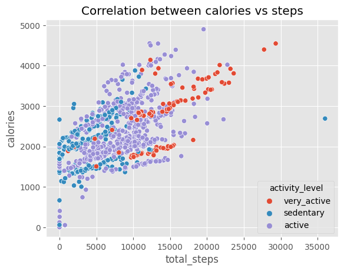
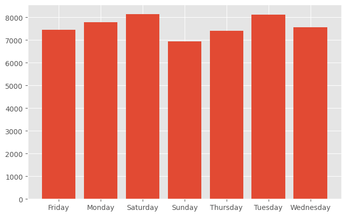
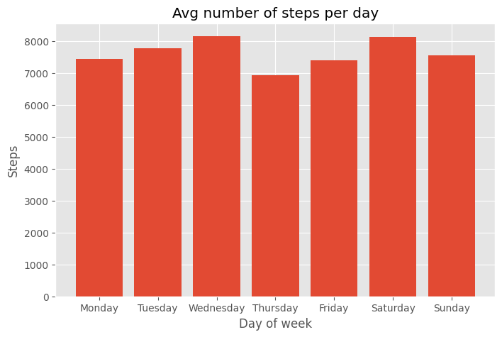
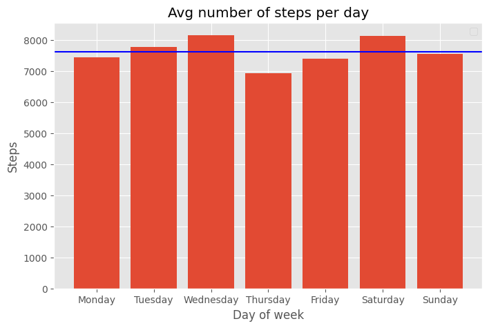

# Data insights for the Bellabeat app

## Goal of the project
The purpose of this analysis project is to search for user patterns of usage of their smart devices in order to gain insights that would later better orientate marketing decisions and unlock new growth opportunities for Bellabeat. So, the main business objectives are:

+ How do our users use smart devices?
+ Identify trends in how consumers use non-Bellabeat smart devices to apply insights into Bellabeat’s marketing strategy.

The analysis of Fitbit tracking data and visualization of results is done using **Python** libraries.

## Data Processing

Data will get processed and cleaned with the help of Python libraries:

+ Correctly format columns' names and types
+ Checking irrelevant columns and subsetting the dataset
+ Check for duplicate rows and missing values

## Analysis Approach

Category analysis will done by creating two categorizations of the users, by level of physical activity and device usage.

physical activity would follow these arguments:

+ Sedentary: less than 6000 daily steps on average
+ Active: between 6000 and 12000 daily steps on average
+ Very active: more than 12000 daily steps on average

Device usage will follow these arguments:

+ Low use: less than 8 hours of use per day.
+ Normal use: between 8 and 16 hours of use per day.
+ High use: more than 16 hours of use per day.

## Visualization

### Correlation between total steps and calories

We can see in this scatterplot a somewhat positive correlation, the more steps done, the more calories burnt. Also, we divided the dots by colors, using the activity_level category, so we can see which group represents the data shown.

### Average number of steps per day

The results show that Monday, Tuesday, and Saturday are the days when the users were more physically active and above the average number of steps overall. Wednesday, Thursday, and Friday are below the average but the three fell into the same area. Sunday is the least active of all the weekdays.

With this information we can interpret that users tend to be more physically active during the first days of the week and during Saturdays, giving us a hint of the activities they may do.

### Percentage of activity in minutes

This pie chart shows that the users are in a sedentary state of activity most of the time, a sixth of the time doing light activity and only 2% of the time being active doing proper exercise.

### Correlation between Activity level minutes and Calories

Figure [0,0] shows there is no specific relation between burned calories with time in sedentary.

Figure [0,1] shows a positive correlation, for a very active person, the more time spent on light activity the more calories are burned.

Figure [1,0] shows there is no specific relation between burned calories with fairly activity time.

Figure [1,1] shows a positive correlation, for a very active person, the more time spent on large-scale activity the more calories are burned.

## Useful Insights

After analyzing FitBit Fitness Tracker Data, the following are the insights that would help influence Bellabeat's marketing strategy

### A multipurpose device

Bellabeat can let know users, that their products are not only meant for sports, or exercise-related activities As the data show, many users spend more time wearing the tracking device on weekends than on weekdays, this could mean that they relate the product just to sports or for only the usual walking to the park on Sundays Bellabeat can show that their products are meant to accompany them wherever they go for any daily activities, such as work And help them track information to improve overall fitness and health This will encourage women from diverse demographic features and backgrounds to use Bellabeat's product meant for all women who care about overall health

### Rewards and reminds

Bellabeat can integrate functions within the Bellabeat app or other products, such as rewards or incentives, and reminds to encourage their users to hit certain marks These marks could be achieving the minimum amount of 7 500 steps per day, certain calorie burning for people who want to lose weight, or the 8-hour sleep pattern Certain rewards could be showing a leaderboard of top users who have reached and maintained the minimum steps a day for longer, virtual medals or prizes, such as discounts or offers For the reminds part, Bellabeat could send notifications to their users when they are lagging behind in such goals, and also it could offer recommendations to their users to help them with their sleep, or achieving their goals

## Datasets Used

The datasets used include:
+ **FitBit Fitness Tracker Data:** The Fitbit Fitness Tracker Data is stored in Kaggle and was made available through Mobius and generated by respondents to a distributed survey via Amazon Mechanical Turk between 03.12.2016 and 05.12.2016. Accessible through Kaggle [here](https://www.kaggle.com/datasets/arashnic/fitbit) and includes the following files.
  + **[dailyActivity_merged.csv:](https://github.com/AryaChirag/Data-Analysis-Bellabeat/blob/main/Data_files/dailyActivity_merged.csv)** This dataset included the transaction data of the customers across all the different states in Australia.
  + **[daily_activity_cleaned.csv:](https://github.com/AryaChirag/Data-Analysis-Bellabeat/blob/main/Data_files/daily_activity_cleaned.csv)** This dataset included the cleaned dataset with a new column created based on the dataset from the dailyActivity_merged.csv file.
+ Comes with 904 rows with 903 being pure data and the other one row being the column headers.
+ It contains the data of 33 users.
  
## Tools and Technologies Used
The tools used in this project include:
+ **Python** - This was needed to conduct Data Quality Assessment and also for Data Cleaning processes. With Python libraries **pandas, numpy, matplotlib, seaborn, datetime** exploratory data analysis of the datasets and gaining useful insights from the data was possible. python code used accessible through this [link](https://colab.research.google.com/drive/1SLsItiFWJGI9KpX-YHn558i80lZQrZ3i?usp=sharing).

## Built With
+ Python 3.10.11
+ Google Colab

## Authors
+ Chirag Arya - [Github Profile](https://github.com/AryaChirag)
